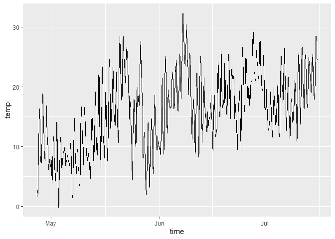
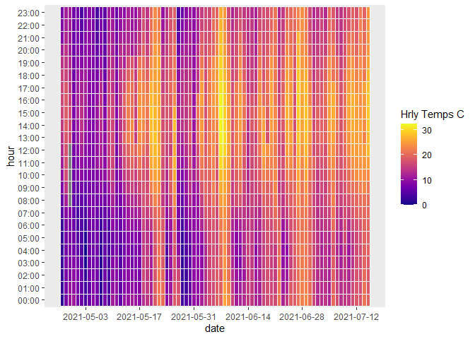

How to write how to\`s
================
Gemenciano Clancleta
2022-08-14

``` r
library(viridis)
```

    ## Loading required package: viridisLite

``` r
library(ggExtra)
library(ggplot2)
library(tidyverse)
```

    ## -- Attaching packages --------------------------------------- tidyverse 1.3.2 --

    ## v tibble  3.1.8     v dplyr   1.0.9
    ## v tidyr   1.2.0     v stringr 1.4.0
    ## v readr   2.1.2     v forcats 0.5.1
    ## v purrr   0.3.4     
    ## -- Conflicts ------------------------------------------ tidyverse_conflicts() --
    ## x dplyr::filter() masks stats::filter()
    ## x dplyr::lag()    masks stats::lag()

``` r
library(weathercan)
```

    ## weathercan v0.6.2
    ## The internal `stations` data has been deprecated in favour of the function `stations()`.
    ## See ?stations for more details.

# Run first

``` r
stations_dl()
```

    ## According to Environment Canada, Modified Date: 2022-08-02 23:30 UTC

    ## Environment Canada Disclaimers:
    ## "Station Inventory Disclaimer: Please note that this inventory list is a snapshot of stations on our website as of the modified date, and may be subject to change without notice."
    ## "Station ID Disclaimer: Station IDs are an internal index numbering system and may be subject to change without notice."

    ## Stations data saved...
    ## Use `stations()` to access most recent version and `stations_meta()` to see when this was last updated

# Look by station name. Return only stations that update hourly

``` r
stations_search("BEAUPORT", interval = "hour")
```

    ## # A tibble: 1 x 16
    ##   prov  station_n~1 stati~2 clima~3 WMO_id TC_id   lat   lon  elev tz    inter~4
    ##   <chr> <chr>         <dbl> <chr>    <dbl> <chr> <dbl> <dbl> <dbl> <chr> <chr>  
    ## 1 QC    BEAUPORT      27803 7010565  71578 XBO    46.8 -71.2    10 Etc/~ hour   
    ## # ... with 5 more variables: start <dbl>, end <dbl>, normals <lgl>,
    ## #   normals_1981_2010 <lgl>, normals_1971_2000 <lgl>, and abbreviated variable
    ## #   names 1: station_name, 2: station_id, 3: climate_id, 4: interval
    ## # i Use `colnames()` to see all variable names

# Stations within a 40 km radios from a lat/long

``` r
stations_search(coords = c(46.759312, -70.974861), dist = 40, interval = "hour")
```

    ## # A tibble: 8 x 17
    ##   prov  station_n~1 stati~2 clima~3 WMO_id TC_id   lat   lon  elev tz    inter~4
    ##   <chr> <chr>         <dbl> <chr>    <dbl> <chr> <dbl> <dbl> <dbl> <chr> <chr>  
    ## 1 QC    LAUZON (AU~   10248 702MKNL     NA WLU    46.8 -71.2  20   Etc/~ hour   
    ## 2 QC    BEAUPORT      27803 7010565  71578 XBO    46.8 -71.2  10   Etc/~ hour   
    ## 3 QC    STE-FOY (U~   27377 701Q004  71392 WJB    46.8 -71.3  91.4 Etc/~ hour   
    ## 4 QC    ILE D'ORLE~    8989 70132G9  71424 WER    47   -70.8   3.6 Etc/~ hour   
    ## 5 QC    QUEBEC/JEA~   26892 701S001  71714 WQB    46.8 -71.4  60   Etc/~ hour   
    ## 6 QC    QUEBEC/JEA~    5251 7016294  71708 YQB    46.8 -71.4  74.4 Etc/~ hour   
    ## 7 QC    QUEBEC INT~   51457 7016293     NA YQB    46.8 -71.4  74.4 Etc/~ hour   
    ## 8 QC    CAP-TOURME~   10869 7041JG6  71384 WTN    47.1 -70.8   6   Etc/~ hour   
    ## # ... with 6 more variables: start <dbl>, end <dbl>, normals <lgl>,
    ## #   normals_1981_2010 <lgl>, normals_1971_2000 <lgl>, distance <dbl>, and
    ## #   abbreviated variable names 1: station_name, 2: station_id, 3: climate_id,
    ## #   4: interval
    ## # i Use `colnames()` to see all variable names

# Download data from a specific station by id (this is U. Laval station)

``` r
w <- weather_dl(station_ids = 27377,
                start = "2021-04-27", end = "2021-07-15")
```

    ## As of weathercan v0.3.0 time display is either local time or UTC
    ## See Details under ?weather_dl for more information.
    ## This message is shown once per session

# Basic plot

``` r
ggplot(data = w, aes(x = time, y = temp)) + geom_line()
```

<!-- -->

# Plot a “heatmap” kind of chart. removeGrid() doesnt seem to be working

``` r
(p <- ggplot(w,aes(date,hour,fill=temp)) +
  geom_tile(color="white", size=0.1) + 
  scale_x_date(date_breaks = "2 weeks") +
  scale_fill_viridis(name="Hrly Temps C",option ="C") + removeGrid(y = T)) 
```

<!-- -->
